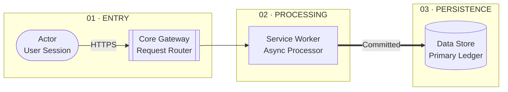

```mermaid
flowchart LR
  subgraph stage1["01 · ENTRY"]
    actor(["Actor<br/>User Session"])
    gateway[["Core Gateway<br/>Request Router"]]
  end

  subgraph stage2["02 · PROCESSING"]
    worker["Service Worker<br/>Async Processor"]
  end

  subgraph stage3["03 · PERSISTENCE"]
    store[("Data Store<br/>Primary Ledger")]
  end

  actor -->|HTTPS| gateway
  gateway --> worker
  worker ==>|Committed| store
```
